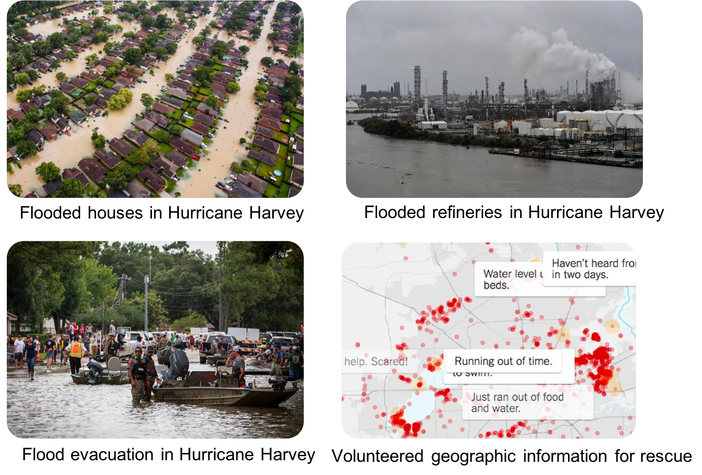
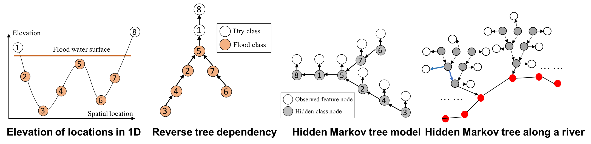

# Project Website: Hidden Markov Tree

## Machine Learning Foundation

## Interdisciplinary Application: Topography-Aware Flood Inundation Mapping from Satellite Images

A fundamental problem in hydrology is mapping the flow and distribution of water on the Earth's surface [r1]. The National Oceanic and Atmospheric Administration (NOAA) National Water Center on The University of Alabama (UA) campus currently operates a next-generation hyper-resolution National Water Model that can forecast the flow of over 2.7 million stream reaches across the entire continental US [2,3]. One major issue of the model is that it is only calibrated and validated by limited observations from around 7000 river gauges. Flood extent maps derived from earth imagery can potentially not only improve the situational awareness for disaster response but also enhance the calibration and validation of the National Water Model. However, the problem is significantly more complex than image classification since the distribution of floodwater is constrained by geographical terrains. Incorporating such topography structures can mitigate image noise and obstacles (e.g., clouds, heavy vegetation).

<center></center>

To address the issue, we developed the geographical Hidden Markov Tree (HMT) [4-9], a probabilistic model tying similar space and topography in the same way that a human analyst visually "assumes" the continuity and connectivity of flood points with similar or lower topography and through obscured views. As illustrated in Figure 1 left, if the pixel at location 5 is flooded due to gravity, nearby lower altitude locations (2-4; 6-7) must also be flooded. That is true even if spectral signatures of these locations suggest otherwise due to clouds or vegetation obscuration. The HMT represents this physical constraint through partial order in a reverse tree structure (Figure 1, middle). If any node is flooded (e.g., node 5), then all of the sub-tree nodes under it must also be flood (e.g., nodes 2-4; 6-7). In HMT, the reverse tree structure is incorporated as a hidden class layer (Figure 1, right), in which each node represents a pixel's unknown class (flood or dry), and the arrows between nodes represent partial order dependency between pixel classes based on the topographic physical constraint. Given an initial probability map of pixel classes (flood or dry) from deep learning or community-generated flood maps, HMT can efficiently re-estimate pixels' classes based on topography through tree traversal operations without manually setting thresholds as in existing work. Implemented in C++, HMT can process up to 10 million pixels in a few minutes. The high computational scalability is a significant advantage of HMT from an operational perspective.



Examples of real-world applications for the HMT model are shown in Figure 2 for Hurricanes Matthew and Harvey. Here, initial flood maps were generated using decision tree results. We can see that the initial classifications only identify water/flood pixels where the water surface is exposed, and areas are missed below tree canopies and other obstructions. In contrast, the HMT provides a complete inundation extent. Preliminary results show that HMT can refine flood inundation extent based on topography.


We are partnering with federal agencies to deploy our tools in real-world disaster response and national water forecasting, including the US Geological Survey (USGS) hydrological remote sensing branch at Reston VA, NASA Ames, and the NOAA National Water Center.

## Software Codes
- Hidden Markov Contour Tree

## Publications
1. Zhe Jiang, Arpan Man Sainju, "Hidden Markov Contour Tree: A Spatial Structured Model for Hydrological Applications", ACM SIGKDD International Conference on Knowledge Discovery and Data Mining (KDD), Anchorage, AK, USA, 2019 
2. Miao Xie, Zhe Jiang, Arpan Man Sainju, "Geographical Hidden Markov Tree for Flood Extent Mapping", ACM SIGKDD International Conference on Knowledge Discovery and Data Mining (KDD), London, UK, 2018 
3. Zhe Jiang, Arpan Man Sainju, "A Hidden Markov Tree Model for Flood Extent Mapping in Heavily Vegetated Areas based on High-Resolution Aerial Imagery and DEM: A Case Study on Hurricane Matthew Floods", International Journal of Remote Sensing (IJRS), Taylor and Francis Group, 2020
4. Arpan Man Sainju, Wenchong He, Zhe Jiang, Da Yan, "Spatial Classification With Limited Observations Based On Physics-Aware Structural Constraint", the Thirty-Fourth AAAI Conference on Artificial Intelligence (AAAI), New York City, NY, USA, 2020
5. Zhe Jiang, Miao Xie, Arpan Man Sainju, "Geographical Hidden Markov Tree", IEEE Transactions on Knoweldge and Data Engineering (TKDE), 2019
6. Arpan Man Sainju, Wenchong He, Zhe Jiang, "A Hidden Markov Contour Tree Model for Spatial Structured Prediction", IEEE Transactions on Knowledge and Data Engineering (TKDE), 2020
7. Arpan Man Sainju, Wenchong He, Zhe Jiang, Da Yan, Haiquan Chen, "Spatial Classification With Limited Observations Based On Physics-Aware Structural Constraint", Frontiers on Big Data, 2021 


## Other references
1. NOAA National Weather Service. Hydrologic information center - flood loss data. [HTML](http://www.nws.%20noaa.gov/hic/), Last Accessed on 6/21/17.
2. 

Welcome to GitHub Pages

You can use the [editor on GitHub](https://github.com/spatialdatasciencegroup/HMCT/edit/gh-pages/index.md) to maintain and preview the content for your website in Markdown files.

Whenever you commit to this repository, GitHub Pages will run [Jekyll](https://jekyllrb.com/) to rebuild the pages in your site, from the content in your Markdown files.

### Markdown

Markdown is a lightweight and easy-to-use syntax for styling your writing. It includes conventions for

```markdown
Syntax highlighted code block

# Header 1
## Header 2
### Header 3

- Bulleted
- List

1. Numbered
2. List

**Bold** and _Italic_ and `Code` text

[Link](url) and 
```

For more details see [GitHub Flavored Markdown](https://guides.github.com/features/mastering-markdown/).

### Jekyll Themes

Your Pages site will use the layout and styles from the Jekyll theme you have selected in your [repository settings](https://github.com/spatialdatasciencegroup/HMCT/settings/pages). The name of this theme is saved in the Jekyll `_config.yml` configuration file.

### Support or Contact

Having trouble with Pages? Check out our [documentation](https://docs.github.com/categories/github-pages-basics/) or [contact support](https://support.github.com/contact) and we’ll help you sort it out.
