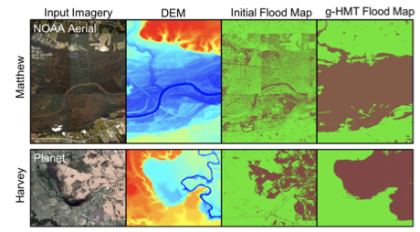

## Advances in Machine Learning Foundation

Spatial structured models are predictive models that capture dependency structure between samples based on their locations. 
Given data samples in a spatial raster framework with explanatory feature layers and a potential field layer, as well as an independent set of training samples with class labels, the spatial structured learning problem aims to learn a model that can predict sample classes in the same framework. For example, in flood extent mapping from earth imagery, data samples are imagery pixels in a regular grid, the explanatory feature layers are spectral bands, and the potential field can be elevation that controls water flow directions. The goal is to predict the classes (flood or dry) of pixels based on both the spectral features and the implicit flow directions based on elevation.

However, the problem poses several unique challenges that are not well addressed in traditional classification problems. First, implicit spatial dependency structure exists between pixel locations. For example, due to gravity, flood water tends to flow from one location to nearby lower locations. Such dependency structure is complex, following contour patterns on a 3D surface. 
Second, data contains rich noise and obstacles. For example, high-resolution earth imagery often has noise, clouds and shadows. In addition, the spectral features of image pixels can be insufficient to distinguish classes (also called class confusion) due to heterogeneity. For instance, pixels of tree canopies overlaying flood water have the same spectral features with those trees in dry areas, yet their classes are different.
Finally, the problem is also computationally challenging due to the cost of modeling complex spatial structure on a large data volume (e.g., billions of sample locations).

Existing spatial structured models often assume that the dependency structure is based on spatial proximity or spatial network topology. To fill the gap, we propose a novel spatial structure model called hidden Markov contour tree (HMCT). It is a probabilistic graphical model that generalizes the common hidden Markov model (HMM) from a total order sequence to a partial order polytree. Specifically, the hidden class layer contains nodes (pixels) in a contour tree structure to reflect flow directions between all locations on a 3D surface. To speed up model learning and class inference, we propose efficient algorithms based on contour tree node collapsing and value pre-aggregation. 

## Interdisciplinary Application: Topography-Aware Flood Inundation Mapping from Satellite Images

A fundamental problem in hydrology is mapping the flow and distribution of water on the Earth's surface [R1]. The National Oceanic and Atmospheric Administration (NOAA) National Water Center on The University of Alabama (UA) campus currently operates a next-generation hyper-resolution National Water Model that can forecast the flow of over 2.7 million stream reaches across the entire continental US [R2,R3]. One major issue of the model is that it is only calibrated and validated by limited observations from around 7000 river gauges. Flood extent maps derived from earth imagery can potentially not only improve the situational awareness for disaster response but also enhance the calibration and validation of the National Water Model. However, the problem is significantly more complex than image classification since the distribution of floodwater is constrained by geographical terrains. Incorporating such topography structures can mitigate image noise and obstacles (e.g., clouds, heavy vegetation).

  

To address the issue, we developed the geographical Hidden Markov Tree (HMT) [1-7], a probabilistic model tying similar space and topography in the same way that a human analyst visually "assumes" the continuity and connectivity of flood points with similar or lower topography and through obscured views. As illustrated in Figure 1 left, if the pixel at location 5 is flooded due to gravity, nearby lower altitude locations (2-4; 6-7) must also be flooded. That is true even if spectral signatures of these locations suggest otherwise due to clouds or vegetation obscuration. The HMT represents this physical constraint through partial order in a reverse tree structure (Figure 1, middle). If any node is flooded (e.g., node 5), then all of the sub-tree nodes under it must also be flood (e.g., nodes 2-4; 6-7). In HMT, the reverse tree structure is incorporated as a hidden class layer (Figure 1, right), in which each node represents a pixel's unknown class (flood or dry), and the arrows between nodes represent partial order dependency between pixel classes based on the topographic physical constraint. Given an initial probability map of pixel classes (flood or dry) from deep learning or community-generated flood maps, HMT can efficiently re-estimate pixels' classes based on topography through tree traversal operations without manually setting thresholds as in existing work. Implemented in C++, HMT can process up to 10 million pixels in a few minutes. The high computational scalability is a significant advantage of HMT from an operational perspective.

  

Examples of real-world applications for the HMT model are shown in Figure 2 for Hurricanes Matthew and Harvey. Here, initial flood maps were generated using decision tree results. We can see that the initial classifications only identify water/flood pixels where the water surface is exposed, and areas are missed below tree canopies and other obstructions. In contrast, the HMT provides a complete inundation extent. Preliminary results show that HMT can refine flood inundation extent based on topography.

  

We are partnering with federal agencies to deploy our tools in real-world disaster response and national water forecasting, including the US Geological Survey (USGS) hydrological remote sensing branch at Reston VA, NASA Ames, and the NOAA National Water Center.

## Software Codes
- Hidden Markov Contour Tree [Code Repository](https://github.com/spatialdatasciencegroup/HMCT/)

## Publications
1. Zhe Jiang, Arpan Man Sainju, "Hidden Markov Contour Tree: A Spatial Structured Model for Hydrological Applications", ACM SIGKDD International Conference on Knowledge Discovery and Data Mining (KDD), Anchorage, AK, USA, 2019 
2. Miao Xie, Zhe Jiang, Arpan Man Sainju, "Geographical Hidden Markov Tree for Flood Extent Mapping", ACM SIGKDD International Conference on Knowledge Discovery and Data Mining (KDD), London, UK, 2018 
3. Zhe Jiang, Arpan Man Sainju, "A Hidden Markov Tree Model for Flood Extent Mapping in Heavily Vegetated Areas based on High-Resolution Aerial Imagery and DEM: A Case Study on Hurricane Matthew Floods", International Journal of Remote Sensing (IJRS), Taylor and Francis Group, 2020
4. Arpan Man Sainju, Wenchong He, Zhe Jiang, Da Yan, "Spatial Classification With Limited Observations Based On Physics-Aware Structural Constraint", the Thirty-Fourth AAAI Conference on Artificial Intelligence (AAAI), New York City, NY, USA, 2020
5. Zhe Jiang, Miao Xie, Arpan Man Sainju, "Geographical Hidden Markov Tree", IEEE Transactions on Knoweldge and Data Engineering (TKDE), 2019
6. Arpan Man Sainju, Wenchong He, Zhe Jiang, "A Hidden Markov Contour Tree Model for Spatial Structured Prediction", IEEE Transactions on Knowledge and Data Engineering (TKDE), 2020
7. Arpan Man Sainju, Wenchong He, Zhe Jiang, Da Yan, Haiquan Chen, "Spatial Classification With Limited Observations Based On Physics-Aware Structural Constraint", Frontiers on Big Data, 2021 

## Other references
1. NOAA National Weather Service. Hydrologic information center - flood loss data. [HTML](http://www.nws.%20noaa.gov/hic/), Last Accessed on 6/21/17.
2. National Oceanic and Atmospheric Administration. National Water Model: Improving NOAA’s Water Prediction Services. [PDF](http://water.noaa.gov/documents/wrn-national-water-model.pdf), Last Accessed on July 1, 2020.
3. Don Cline. Integrated water resources science and services: an integrated and adaptive roadmap for operational implementation. Technical Report IWRSS-2009-03-02, National Oceanic and Atmospheric Administration, 2009.

